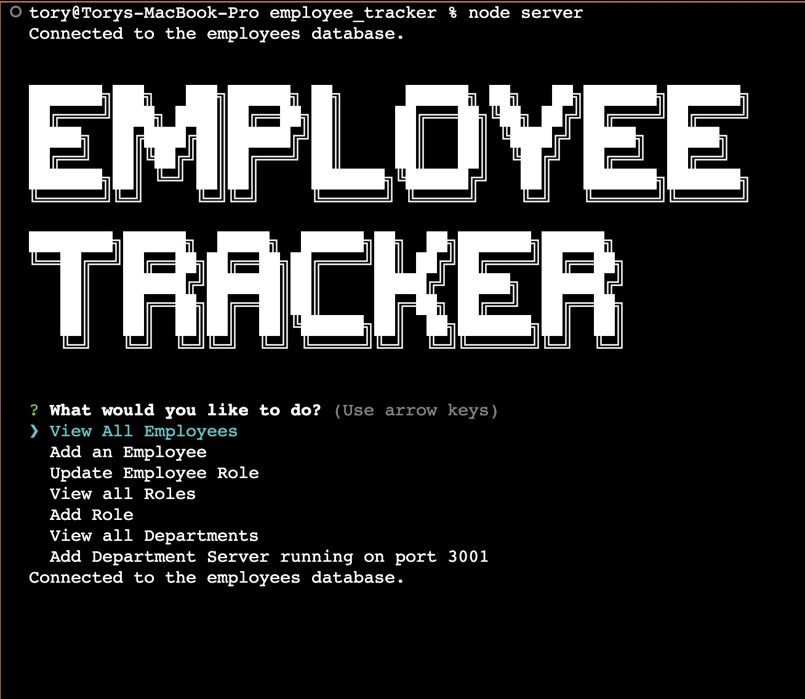
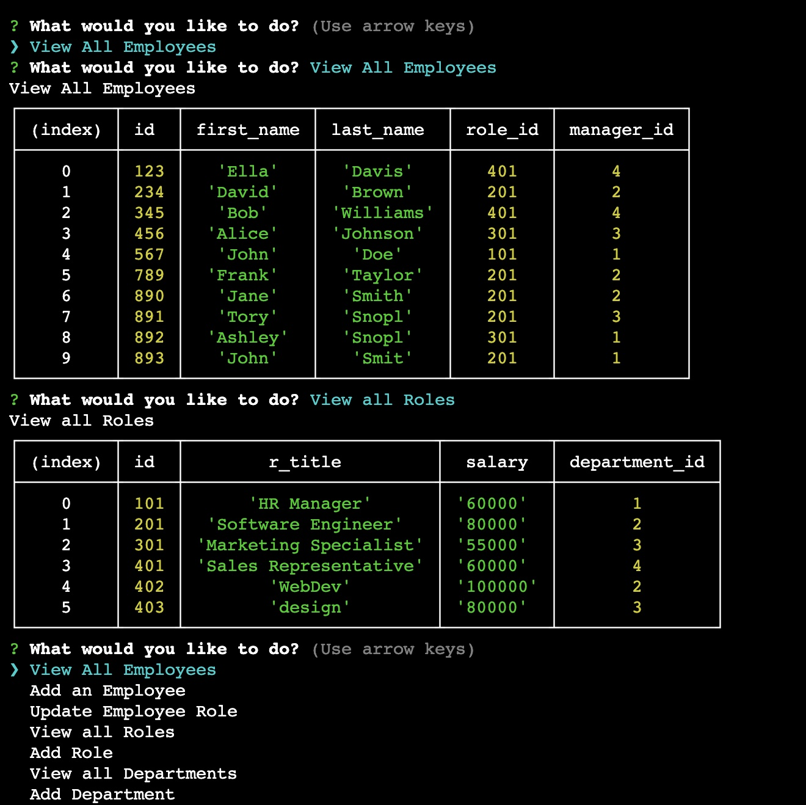

# Employee Tracker
This is a command line interface app built with MYSQL and Inquirer. It allows the user to return the desired data in a user friendly interface.

## User Story
>GIVEN a command-line application that accepts user input
>WHEN I start the application
>THEN I am presented with the following options: view all departments, view all roles, view all employees, add a department, add a role, add an employee, and update an employee role

>WHEN I choose to view all departments
>THEN I am presented with a formatted table showing department names and department ids

>WHEN I choose to view all roles
>THEN I am presented with the job title, role id, the department that role belongs to, and the salary for that role

>WHEN I choose to view all employees
>THEN I am presented with a formatted table showing employee data, including employee ids, first names, last names, job titles, departments, salaries, and managers that the employees report to

>WHEN I choose to add a department
>THEN I am prompted to enter the name of the department and that department is added to the database

>WHEN I choose to add a role
>THEN I am prompted to enter the name, salary, and department for the role and that role is added to the database

>WHEN I choose to add an employee
>THEN I am prompted to enter the employee’s first name, last name, role, and manager, and that employee is added to the database

>WHEN I choose to update an employee role
>THEN I am prompted to select an employee to update and their new role and this information is updated in the database

## What I Learned
This was a fun project to combine inquirer and MYSQL in order to make the information in the database more accessible. It really helped solidify how useful inquirer can be. Although simple, this app has real world application. It was initally a challenge to figure out the syntax to use the input from the inquirer in the db.query statements.

I really like discovering new npms to use like cfonts. It was so easy to use, and took away the challenge of creating anscii art for the logo graphic. 

I continue to learn new Javascript commands too. I initially thought that formatting the JSON into tables in the CLI would be more labor intensive. however just using console.table instead of console.log took care of that. 

Overall, I think I would really like to work with databases and MYSQL in the future. 

## Final Product

## Deployed Application
[Github Repo](https://github.com/TorySnopl/employee_tracker)

[Video Demonstration](https://drive.google.com/file/d/1wmrIX8YkMUnLXdHiIbSChBahHB8OU3l9/view)

## Source Code
There was no source code provided from the UofO bootcamp. I did take advantage of the following NPM's: MYSQL, Inquirer, Express, and cfonts. Thanks also to the awesome staff at askBCS. 